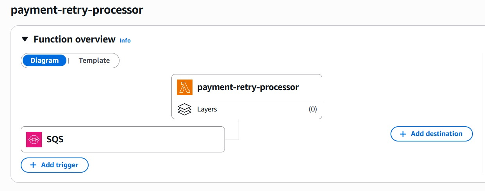
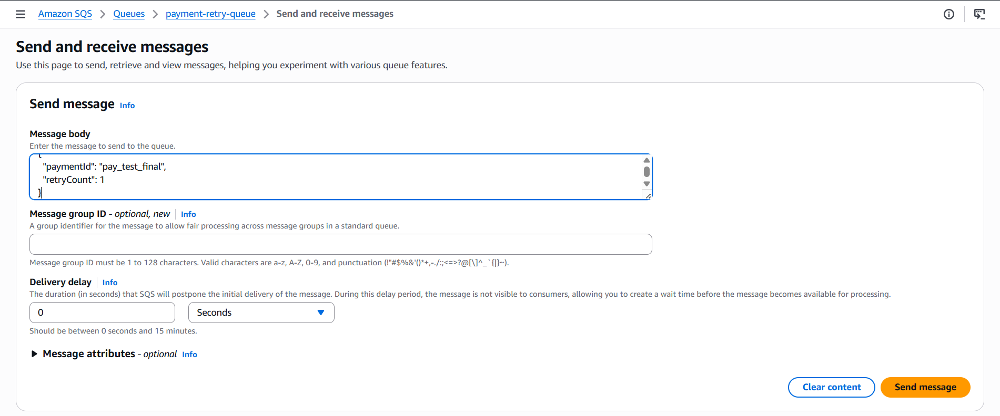
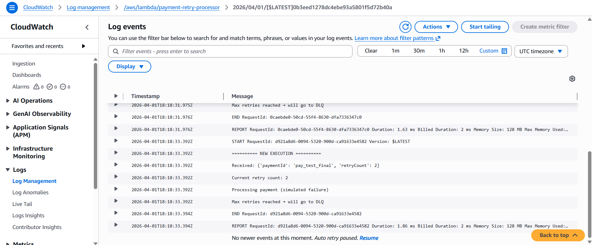
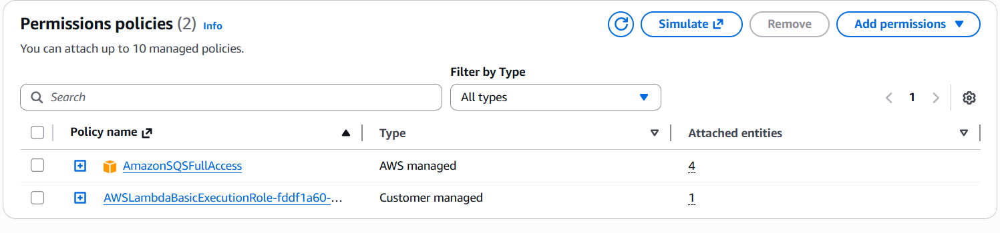

# Payment Retry Mechanism using AWS SQS & Lambda

## Overview

This project demonstrates a retry mechanism for failed payments using AWS SQS and Lambda.

When a payment fails, it is sent to an SQS queue. A Lambda function processes the message and retries it with a delay. After multiple retries, the process stops.

---

## Architecture

Payment Failure → SQS Queue → Lambda → Retry → Stop after max attempts

---

## Technologies Used

* AWS Lambda
* Amazon SQS
* Amazon CloudWatch

---

## Lambda Code

```python
# simplified version

QUEUE_URL = "YOUR_SQS_QUEUE_URL"

# retry logic with delay
```

---

## How It Works

1. Message is sent to SQS
2. Lambda is triggered
3. Payment processing fails (simulated)
4. Message is retried with increased retryCount
5. Stops after 3 attempts

---

## Test Message

```json
{
  "paymentId": "pay_test_001",
  "retryCount": 0
}
```

---

## Screenshots

### Lambda Trigger



---

### SQS Message Sent



---

### CloudWatch Logs (Retry Execution)



---

### IAM Permissions



---

## Output Observed

* Lambda triggered automatically
* Retry attempts logged
* retryCount increases on each retry
* Stops after max retries

---

## Limitations

* No idempotency
* No database
* Basic retry logic
* DLQ not demonstrated

---

## Conclusion

This project demonstrates a basic event-driven retry mechanism using AWS services.

Suitable for learning and DevOps portfolio projects.
